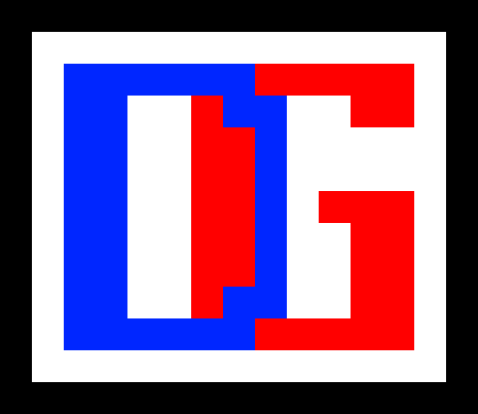

# SmartDG

A C++ Library used by Dependency-Graph extension of SmartMDSD Toolchain

Copyright (c) 2020 Technische Hochschule Ulm, Servicerobotics Ulm, Germany

Licence: BSD 3-Clause License ( https://opensource.org/licenses/BSD-3-Clause )

        Servicerobotik Ulm 
        Christian Schlegel
        Ulm University of Applied Sciences
        Prittwitzstr. 10
        89075 Ulm
        Germany

	  http://www.servicerobotik-ulm.de/

	Contributors:
	Vineet Nagrath (Vineet.Nagrath@thu.de)
	Christian Schlegel (Christian.Schlegel@thu.de)
	
## Link to [Official SmartDG Tutorial Wiki](https://wiki.servicerobotik-ulm.de/tutorials:smartdg:start)

